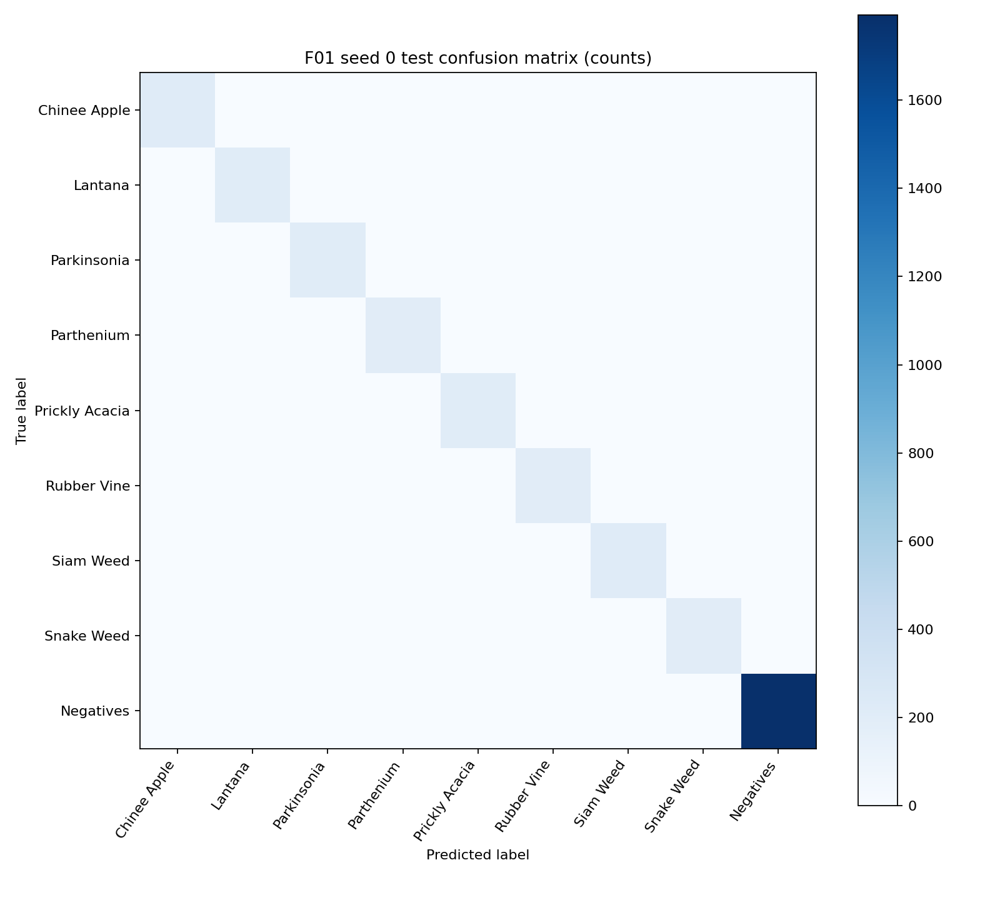

# Báo cáo Lab Day 2 — DeepWeeds

## Tóm tắt

- Cấu hình final được chọn bằng validation: F01.
- Final macro-F1 test: 0.9759 ± 0.0001.
- T00 baseline macro-F1 test: 0.9669 ± 0.0026.
- Final hơn baseline Δ=0.0090; Δ lớn hơn std lớn nhất 0.0026.

## Dữ liệu và thiết lập

Dùng DeepWeeds fold 0 nguyên bản, 9 lớp. Train chỉ cập nhật trọng số; validation chọn backbone, siêu tham số, checkpoint, suy luận và temperature. Không gộp validation vào train. Test chỉ dùng sau khi khóa cấu hình, một lượt cho mỗi seed. Metric chính là macro-F1; báo cáo thêm top-1, balanced accuracy, ECE 15-bin, per-class và latency.

Số cấu hình train đã lưu: 20. Split sizes: {'train': 10501, 'val': 3501, 'test': 3507}.
Hardware/runtime: Tesla T4; torch version được lưu trong mỗi run config. Input preprocessing: resize + center crop, ImageNet mean/std.

Thứ tự lớp theo eval.py: Chinee Apple, Lantana, Parkinsonia, Parthenium, Prickly Acacia, Rubber Vine, Siam Weed, Snake Weed, Negatives.

| Class | Train | Validation | Test |
|---|---:|---:|---:|

| Chinee Apple | 675 | 225 | 226 |
| Lantana | 637 | 213 | 213 |
| Parkinsonia | 618 | 206 | 207 |
| Parthenium | 613 | 204 | 205 |
| Prickly Acacia | 637 | 212 | 213 |
| Rubber Vine | 605 | 202 | 202 |
| Siam Weed | 644 | 215 | 215 |
| Snake Weed | 609 | 203 | 204 |
| Negatives | 5463 | 1821 | 1822 |

## Backbone

| ID | Backbone | Tag | Params M | GMAC | Val macro-F1 | Val top-1 | sec/epoch |
|---|---|---|---:|---:|---:|---:|---:|
| B01 | resnet50 | a1_in1k | 23.526473 | 4.109483 | 0.825739 | 0.870608 | 34.403429 |
| B02 | resnext50_32x4d | a1h_in1k | 22.998345 | 4.257352 | 0.870173 | 0.899743 | 42.98499 |
| B03 | convnext_tiny | in12k_ft_in1k | 27.827049 | 4.469676 | 0.971141 | 0.977435 | 51.740331 |
| B04 | deit_small_patch16_224 | fb_in1k | 21.669129 | 4.250294 | 0.95584 | 0.968295 | 33.848749 |
| B05 | mobilenetv3_large_100 | ra_in1k | 4.213561 | 0.224168 | 0.874031 | 0.904027 | 26.896872 |

## Công thức huấn luyện

| ID | Backbone | Trục | Khác T00 | Val macro-F1 | Δ vs T00 |
|---|---|---|---|---:|---:|
| T00 | convnext_tiny | baseline | baseline recipe | 0.971141 | 0.0 |
| T00 | convnext_tiny | baseline | baseline recipe | 0.966213 | 0.0 |
| T00 | convnext_tiny | baseline | baseline recipe | 0.967162 | 0.0 |
| T01 | convnext_tiny | A: initialization | init=frozen | 0.86598 | -0.105161 |
| T02 | convnext_tiny | A: initialization | init=scratch, pretrained=False | 0.350974 | -0.620166 |
| T03 | convnext_tiny | B: augmentation | aug=color | 0.964435 | -0.006706 |
| T04 | convnext_tiny | B: augmentation | aug=randaug | 0.968636 | -0.002505 |
| T05 | convnext_tiny | B: augmentation | mix=cutmix, mix_alpha=1.0 | 0.978589 | 0.007449 |
| T06 | convnext_tiny | C: loss | loss=ls, label_smoothing=0.1 | 0.966406 | -0.004735 |
| T07 | convnext_tiny | C: loss | loss=focal, focal_gamma=2.0 | 0.967539 | -0.003602 |
| T08 | convnext_tiny | D: sample balance | sampler=balanced | 0.966872 | -0.004269 |
| T09 | convnext_tiny | A+B+C combination | best A=T00, B=T05, C=T00 by validation | 0.978589 | 0.007449 |

Các sweep thường dùng một seed để sàng lọc; chưa đủ căn cứ xem chênh lệch nhỏ hơn biến thiên seed là cải thiện chắc chắn.

## Suy luận và latency

| ID | Phương pháp | K | Val macro-F1 | ECE val | p50 ms | p95 ms | p99 ms |
|---|---|---:|---:|---:|---:|---:|---:|
| I00 | 1-view FP32 | 1 | 0.978589 | 0.005127 | 7.184157 | 8.18951 | 8.834999 |
| I01 | horizontal-flip TTA; probability mean | 2 | 0.980293 | 0.003455 | 13.452686 | 15.474747 | 16.173265 |
| I02 | five-crop TTA; probability mean | 5 | 0.977741 | 0.004168 | 33.297719 | 35.878164 | 36.798742 |
| I03 | horizontal-flip; probability mean | 2 | 0.980293 | 0.003455 | 13.452686 | 15.474747 | 16.173265 |
| I03 | horizontal-flip; logit mean | 2 | 0.980293 | 0.00458 | 13.452686 | 15.474747 | 16.173265 |
| I07 | temperature scaling on I00 | 1 | 0.978589 | 0.004226 | 7.184157 | 8.18951 | 8.834999 |
| I00B32 | 1-view FP32 batch 32 | 1 | 0.978589 | 0.005127 | 133.76473 | 135.363005 | 136.232166 |

Validation inference tốt nhất trong các phương pháp đã ghi là horizontal-flip TTA; probability mean.
Latency batch-1 p95 for I01 (horizontal-flip TTA; probability mean): 15.474747050757287 ms on Tesla T4.
Đo latency cần warmup ít nhất 10 lần, synchronize GPU và ít nhất 50 lần đo; notebook lưu rõ GPU/dtype/batch/resolution và việc tính preprocessing.

## Chung kết và per-class

| ID | Seed | Macro-F1 test mean | std | Top-1 mean | std | ECE uncal mean | std | ECE calibrated mean | std |
|---|---|---:|---:|---:|---:|---:|---:|---:|---:|
| F01 | mean ± std | 0.975867 | 0.000117 | 0.981085 | 0.000329 | 0.005677 | 0.000979 | 0.005735 | 0.002412 |
| T00 | mean ± std | 0.966879 | 0.002623 | 0.974242 | 0.001621 | 0.020055 | 0.001201 | 0.020056 | 0.001201 |

Confusion matrix totals for F01 are recalculated from all saved seed prediction files by eval.py.

| Actual / Predicted | Chinee Apple | Lantana | Parkinsonia | Parthenium | Prickly Acacia | Rubber Vine | Siam Weed | Snake Weed | Negatives |
|---|---|---|---|---|---|---|---|---|---|
| Chinee Apple | 647 | 1 | 0 | 1 | 0 | 0 | 0 | 15 | 14 |
| Lantana | 0 | 624 | 0 | 0 | 0 | 0 | 0 | 7 | 8 |
| Parkinsonia | 1 | 0 | 615 | 0 | 2 | 0 | 0 | 0 | 3 |
| Parthenium | 3 | 0 | 8 | 597 | 7 | 0 | 0 | 0 | 0 |
| Prickly Acacia | 2 | 0 | 4 | 1 | 630 | 0 | 0 | 0 | 2 |
| Rubber Vine | 0 | 0 | 0 | 0 | 0 | 591 | 0 | 0 | 15 |
| Siam Weed | 0 | 0 | 0 | 0 | 0 | 0 | 640 | 0 | 5 |
| Snake Weed | 5 | 1 | 0 | 1 | 0 | 1 | 1 | 589 | 14 |
| Negatives | 11 | 9 | 1 | 1 | 25 | 14 | 12 | 4 | 5389 |

Per-class metrics over final seeds:

| Class | Support | Precision mean | Recall mean | Recall std | F1 mean | F1 std |
|---|---:|---:|---:|---:|---:|---:|
| Chinee Apple | 226 | 0.967381 | 0.954277 | 0.006759 | 0.960696 | 0.00637 |
| Lantana | 213 | 0.982733 | 0.976526 | 0.004695 | 0.979604 | 0.005855 |
| Parkinsonia | 207 | 0.979334 | 0.990338 | 0.004831 | 0.984789 | 0.001366 |
| Parthenium | 205 | 0.993333 | 0.970732 | 0.008449 | 0.981897 | 0.005759 |
| Prickly Acacia | 213 | 0.948909 | 0.985915 | 0.00939 | 0.967002 | 0.002596 |
| Rubber Vine | 202 | 0.975426 | 0.975248 | 0.008575 | 0.975262 | 0.002229 |
| Siam Weed | 215 | 0.980101 | 0.992248 | 0.002685 | 0.986132 | 3.7e-05 |
| Snake Weed | 204 | 0.957789 | 0.962418 | 0.007488 | 0.960064 | 0.001439 |
| Negatives | 1822 | 0.988812 | 0.985913 | 0.002707 | 0.987357 | 0.000503 |

The two required hard classes are Chinee Apple and Snake Weed; review their recall and the largest off-diagonal confusion entries together.

Final hơn baseline Δ=0.0090; Δ lớn hơn std lớn nhất 0.0026.

## Kết luận và hạn chế

Kết luận về cấu hình dựa trên validation; các chỉ số test chỉ mô tả cấu hình đã khóa. Một fold chia ngẫu nhiên, không theo địa điểm, có thể làm điểm lạc quan ở vùng, mùa hoặc điều kiện ánh sáng khác. Báo cáo độ ổn định bằng mean ± sample std qua số seed thực tế; nếu thiếu ba seed, kết luận đó còn hạn chế.

Phương pháp có macro-F1 val cao nhất đã đo: horizontal-flip TTA; probability mean.
Cấu hình có p95 ≤ 100 ms batch 1 đã đo: horizontal-flip TTA; probability mean.

## Tái lập

Mọi số liệu trong báo cáo lấy từ runs/*/seed*/done.json, history.csv, inference_results.json và predictions/*_test.csv. File eval.py của repo gốc được dùng để đối chiếu và tính lại chỉ số. Các run thiếu log hoặc prediction không được dùng làm bằng chứng.
